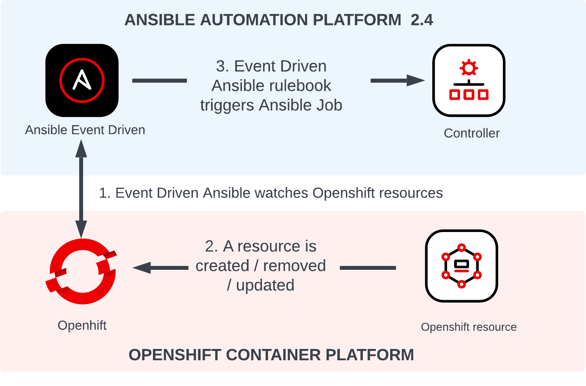
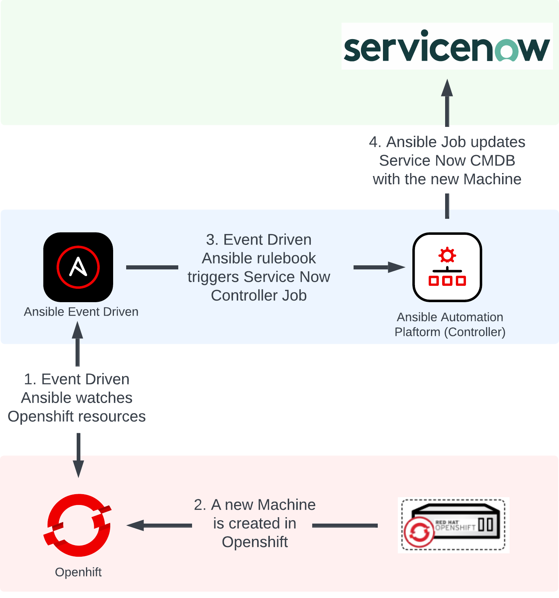
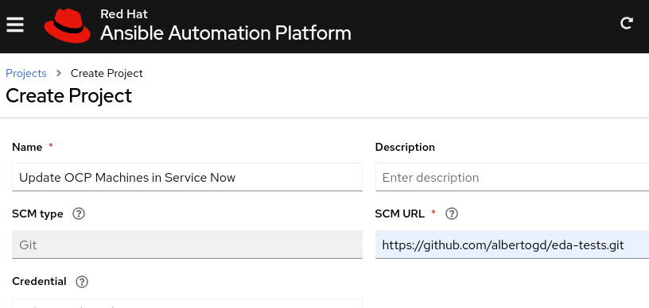
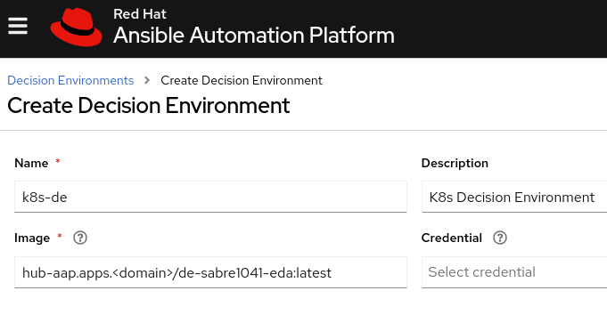
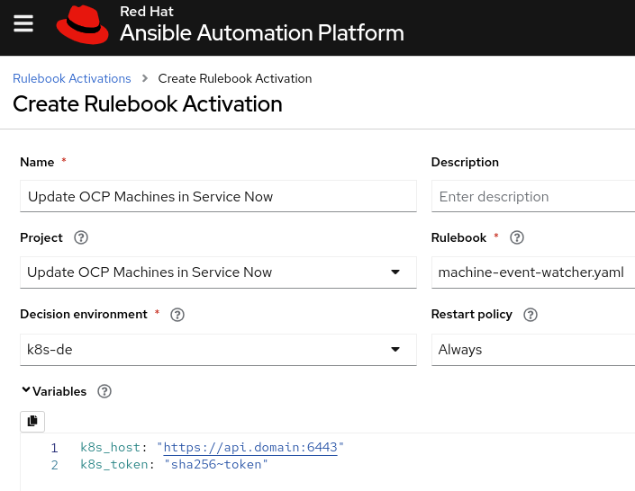
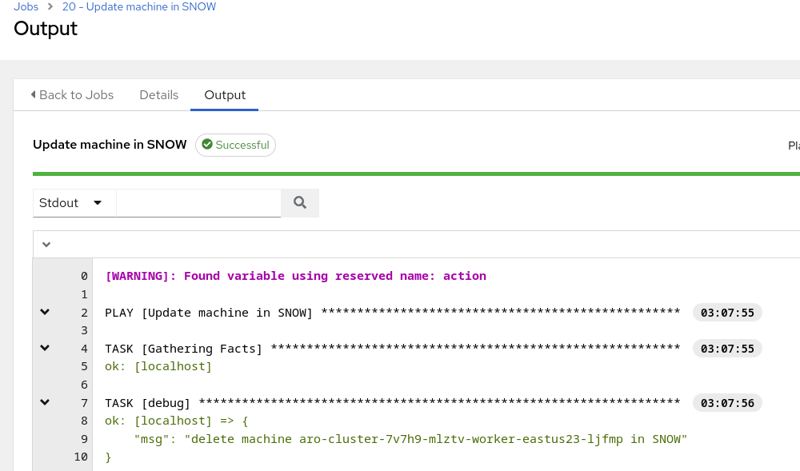

# Running Ansible Jobs in AAP 2.4+ with EDA watching OpenShift events

In the article [Kubernetes Meets Event-Driven Ansible (EDA)](https://www.ansible.com/blog/kubernetes-meets-event-driven-ansible), Andrew Block explained how Automation and Kubernetes go hand in hand and how Ansible already plays a role within this ecosystem. When the article was written, EDA was not included in Ansible Automation Platform (AAP) yet, and the rulebooks had to be executed in the CLI or packaged within custom solutions. With the release of AAP 2.4, EDA is now part of AAP, and the Ansible Rulebooks can be executed in AAP.

In this article, I will describe the use case of running Ansible Jobs in AAP 2.4 with EDA watching OpenShift events:  _Register/unregister OpenShift machines in Service Now watching machine-api events_




## Register/unregister OpenShift machines in Service Now watching machine-api events

In OpenShift, a MachineSet creates and removes Machines (Nodes) just by changing the `replicas` parameter. However, triggering post-event actions is not easy. Some companies need to register/unregister the machine in their CMDB. Others need to add/remove the machine IP in their corporate DNS (Bind, Infoblox, etc.).

With EDA, we’ll be able to register/unregister Openshift machines in Service Now watching events. 


### Prerequisites

As a first step, we need [Ansible Automation Platform 2.4](https://access.redhat.com/documentation/en-us/red_hat_ansible_automation_platform/2.4/html/red_hat_ansible_automation_platform_installation_guide/assembly-platform-install-scenario) with EDA deployed:


* [Deploying Event-Driven Ansible controller with Ansible Automation Platform Operator on OCP](https://access.redhat.com/documentation/en-us/red_hat_ansible_automation_platform/2.4/html/getting_started_with_event-driven_ansible_guide/installation-of-eda-controller#deploying-eda-controller-with-aap-operator-on-ocp)
* [Installing Event-Driven Ansible controller on Red Hat Ansible Automation Platform](https://access.redhat.com/documentation/en-us/red_hat_ansible_automation_platform/2.4/html/getting_started_with_event-driven_ansible_guide/installation-of-eda-controller#installing-eda-controller-on-red-hat-aap_eda-getting-started)


### Solution

In EDA, there will be an Ansible Rulebook to watch for Machine API events. When the rulebook detects a Machine creation/deletion event, it will trigger an Ansible Job Template in AAP to register/unregister the machine in CMDB (ServiceNow). 





For this solution, you’ll need:

* An Ansible Rulebook to watch for the events, and trigger an Ansible Job Template when we detect a Machine create/delete event.
    * The Ansible Rulebook  in a Git repository.
    * In the EDA UI, the Ansible Rulebook added to a Project.
* The Decision Execution (DE) Image  that includes the Ansible and Python dependencies
    * A container image that is created and uploaded to our container registry or Automation Hub.
    * In the EDA UI, the DE is added as a Decision Environment. 
* An Ansible Job Template to register/unregister a Machine in ServiceNow.
    * The playbook  in a git repository.
    * In automation controller, a Project and a Job Template 
* An activation rulebook to run an Ansible Rulebook to watch for a specific Openshift cluster
    * In EDA UI, an activation rulebook will be created


#### Ansible Job in Ansible Automation Platform

The Ansible Rulebook will run the Ansible Job Template `Update machine in SNOW`, so we need to create this Job Template in Ansible Automation Platform.

**Project**

First, create a playbook to update a machine in ServiceNow. Create the playbook `snow.yaml`, and commit and push the addition to your git repo.


```
---
- name: Update a machine in SNOW
  hosts: localhost
  gather_facts: false
  tasks:
 
    - name: Register the newly-created host instance
      servicenow.itsm.configuration_item:
        name: "{{ machine }}"
        sys_class_name: cmdb_ci_vm_instance
      when: action == 'add'

    - name: Deregister the removed host instance
      servicenow.itsm.configuration_item:
        name: "{{ machine }}"
        state: absent
      when: action == 'delete'
```


Create a [Project](https://docs.ansible.com/automation-controller/latest/html/userguide/projects.html) in Ansible Automation Platform with your git repo, and then create a [Job Template](https://docs.ansible.com/automation-controller/latest/html/userguide/job_templates.html) using this Project, and add a [Survey](https://docs.ansible.com/automation-controller/latest/html/userguide/job_templates.html#surveys) with the 2 variables defined in the ansible-rulebook: **machine** and **action**.

> **_NOTE:_** After you add the Survey variables, don’t forget to click on **Survey Enabled**.


#### Ansible Rulebook

As the [Ansible documentation ](https://ansible.readthedocs.io/projects/rulebook/en/stable/introduction.html#why-rulebooks)details “We need a rulebook to tell the system what events to flag and how to respond to them”. In the ansible-rulebook, there are 2 main sections: sources and rules. 


##### Sources

The sources are the plugins to read events. They are written in Python and include a number of out of the box options that are included with EDA. The source plugin used to watch Kubernetes events is named _sabre1041.eda.k8s_. For this situation, OpenShift _Event_ or _Machine_ objects provide information about Machines that are created or deleted. In this case, we’ll use Event objects, but we can achieve the same results watching Machine objects.

The `sabre1041.eda.k8s` source:

* Watches for _Event_ objects in the `openshift-machine-api` namespace.
* Specifies the OpenShift API server (`host` var) configured with the variable `k8s_host`
* Specifies the ServiceAccount token (`api_key` var) configured with the variable `k8s_token`

Both vars, `k8s_host` and `k8s_token`, are configured later in the Rulebook activation in EDA UI.

The OpenShift ServiceAccount is any ServiceAccount that is available in OpenShift for this purpose.  A role needs to be added to the targeted ServiceAccount to be able to perform the watch/list/get actions in the `openshift-machine-api` namespace.  An example of the ClusterRole and RoleBinding needed.


ClusterRole:
```
apiVersion: rbac.authorization.k8s.io/v1
kind: ClusterRole
metadata:
  name: events-reader
rules:
- apiGroups:
  - "" 
  resources:
  - events
  verbs:
  - list
  - watch
  - get
```

RoleBinding:
```
apiVersion: rbac.authorization.k8s.io/v1
kind: RoleBinding
metadata:
  name: events-reader
  namespace: openshift-machine-api
roleRef:
  apiGroup: rbac.authorization.k8s.io
  kind: ClusterRole
  name: events-reader
subjects:
- kind: ServiceAccount
  name: default
  namespace: aap
```

##### Rules

We’ll add one rule for detecting deleted Machines and another rule for detecting added machines. For each rule, we’ll run the job template `Update machine in SNOW` if the condition for the rule is met. The conditions are:

* `event.resource.reason` == “Deleted” for machines deleted
* `event.resource.reason` == “Updated” for Added machines

We’ll add the condition **event.resource.count** to avoid running the same job multiple times, as `machine-api` creates multiple events when a machine is deleted or added.

> **_NOTE:_** You can remove the `event.resource.count` condition, as your `Update machine in SNOW` playbooks should be idempotent, and could be executed multiple times with the same parameter.

We’ll define 2 extra_vars to send to the Job: _machine_ which contains the hostname, and _action _which is _add _or _delete_.

The whole rulebook `machine-event-watcher.yaml:`

```
- name: Listen for Machine resource events
  hosts: all
  sources:
    - sabre1041.eda.k8s:
        api_version: v1 
        kind: Event
        namespace: openshift-machine-api
        host: "{{ k8s_host }}"
        api_key: "{{ k8s_token }}"
  rules:
    - name: Notify Deleted machines
      condition: event.resource.reason == "Deleted" and event.resource.count == 1
      action:
        run_job_template:
          name: "Update machine in SNOW"
          organization: "Default"
          job_args:
            extra_vars:
              machine: "{{ event.resource.involvedObject.name }}"
              action: "delete"
    - name: Notify Added machines
      condition: event.resource.reason == "Updated" and event.resource.count == 1
      action:
        run_job_template:
          name: "Update machine in SNOW"
          organization: "Default"
          job_args:
            extra_vars:
              machine: "{{ event.resource.involvedObject.name }}" 
              action: "add" 
```

We’ll add this rulebook in a git repository, and in EDA UI, we’ll create a [Project](https://access.redhat.com/documentation/en-us/red_hat_ansible_automation_platform/2.4/html/event-driven_ansible_controller_user_guide/eda-set-up-new-project):



#### Decision Environment

As playbooks in AAP are executed using an Execution Environment (EE) image , Ansible-rulebooks are executed using a Decision Environment (DE) image . As we need to include our event source plugin in the DE as it is not provided in the base DE by default we create the configuration yaml for ansible-builder to create a new DE much in the  same way as we do to [create an EE](https://developers.redhat.com/articles/2023/05/08/how-create-execution-environments-using-ansible-builder). The base image used is _de-minimal-rhel8:latest_, and we need to add:


* The collections ansible.eda and sabre1041.eda (which provides the event source plugin for k8s) 
* The python libraries _requests_ and _kubernetes_, which are required by the event source plugin
* The system packages: pkgconf-pkg-config, systemd-devel, gcc and python39-devel

This is the Decision Environment Definition file: `de-sabre1041-eda.yml`


```
version: 3

images:
  base_image:
    name: 'registry.redhat.io/ansible-automation-platform-24/de-minimal-rhel8:latest'

dependencies:
  galaxy:
    collections:
      - ansible.eda
      - sabre1041.eda
  python:
    - requests
    - kubernetes
  system:
    - pkgconf-pkg-config [platform:rpm]
    - systemd-devel [platform:rpm]
    - gcc [platform:rpm]
    - python39-devel [platform:rpm] 
  python_interpreter:
    package_system: "python39"

options:
  package_manager_path: /usr/bin/microdnf
```

Build the Decision Environment image and push to the Automation Hub (or any other registry):

```
$ `ansible-builder build -f de-sabre1041-eda.yml -t de-sabre1041-eda:latest`
$ podman tag localhost/de-sabre1041-eda:latest <automationhub>/de-sabre1041-eda:latest 
$ podman push <automationhub>/de-sabre1041-eda:latest 
```

In EDA UI, [add the custom Decision Environment](https://access.redhat.com/documentation/en-us/red_hat_ansible_automation_platform/2.4/html/event-driven_ansible_controller_user_guide/eda-set-up-new-decision-environment):



#### Rulebook Activation

To create a rulebook activation, you need to have a controller token added. If you have not added one yet, please [follow the documentation to add it.](https://access.redhat.com/documentation/en-us/red_hat_ansible_automation_platform/2.4/html/event-driven_ansible_controller_user_guide/eda-set-up-token).

[Create the Rulebook Activation](https://access.redhat.com/documentation/en-us/red_hat_ansible_automation_platform/2.4/html/event-driven_ansible_controller_user_guide/eda-set-up-rulebook-activation) in the EDA UI. Select the Project, the rulebook and the Decision Environment, And configure the OpenShift variables: **k8s_host** with the API server, and **k8s_token** with a ServiceAccount token.



### Testing the Solution

Add or remove a machine within your OpenShift environment. Openhsift machine-api will create multiple events in openshift-machine-api namespace. As the rulebook is monitoring for Event changes in the openshift-machine-api namespace, when the condition is met, it will trigger the job  "**Update machine in SNOW"**. Check in your AAP that the Job has been triggered.



### Summary

We’ve created an Ansible Rulebook to watch for Openshift Machine events, and trigger an Ansible Job to add or remove the machine in ServiceNow. This concept can be applied to many purposes in Openshift, like day-2 configuration when an Openshift resource is modified; notification or remediation when an Event contains a specific error message.
