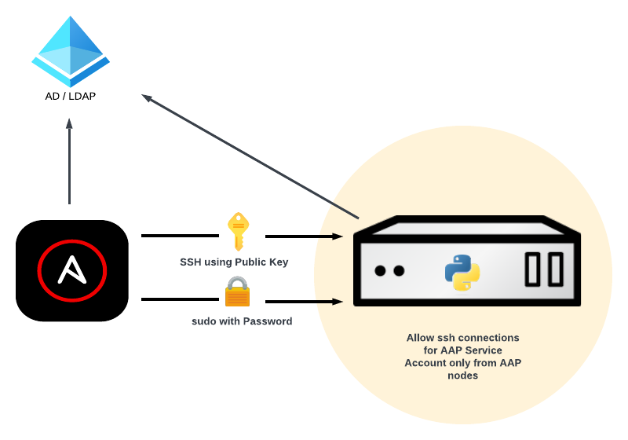

# Hardening ssh connections to managed hosts with Ansible Automation Platform

Ansible Automation Platform (AAP), as a platform for implementing enterprise-wide automation, is a central point in many organizations. From there, AAP can access any host for automation purposes. Security has many layers (see [Zero Trust architecture](https://www.redhat.com/en/topics/security/what-is-zero-trust)), and this article focuses on one specific security layer: **mitigate the ssh base attacks on managed hosts**. We cannot eliminate all the security risks, but we’ll harden our managed hosts for eliminating some of them (**brute force attack**), and mitigating others (**allowing ssh connections only from authorized hosts**, **setting up sudo password**). 

Although this article’ s use case is around AAP, most of the hardening configuration is applied to the **managed hosts** (editing `sshd_config`, `sssd.conf`, `access.conf`). So you can apply the same concepts if you have any other central point that uses ssh, like [Red Hat Satellite](https://www.redhat.com/en/technologies/management/satellite) if you’re using the **Remote Execution** feature.

We’ll hardened the **managed host configuration** using:

* Multiple Service Accounts for ssh login to the hosts, created in AD/LDAP with:
    * Public key stored in AD/LDAP for ssh login with Public Key authentication
    * Password stored in AD/LDAP for sudo only (not for ssh login)
* In any managed host:
    * A service account can login only from AAP execution nodes (any attempt to log in from any other place will be rejected)
    * Privilege escalation with sudo for any Service Account needs password




## Start base scenario

We start from a standard non-hardened solution deployment where:

* One *AAP* Service Account:
    * Used for ssh login to the hosts
    * Created in AD/LDAP with a random password.
* In any host:
    * The Service Account can **log in** and with the password
    * The Service Account can **sudo** without using password

Does this configuration sound familiar?

## Hardening configuration

### Create Multiple Service Account

Many companies create only one service account per service. In the AAP scenario, a Service Account to be used by AAP to connect to all the managed hosts. However, if for any reason this service account is compromised, the attacker could access any managed host.

We’ll apply again the security layer concept: we’ll create different service accounts. And at this point, there is not a common approach: you should check what’s the best based on infrastructure architecture. Some of the strategies for creating different service account are:

* `Location/datacenter` -> create one service account per datacenter
* `Organization/Domain` -> create one service account per organization/domain
* `OS` -> create one service account per Host type (RHEL 6, 7, 8, 9…)
* `App type` -> create one service account per App (DBs, Apache, Kafka, …)
* `Security` -> create one service account per security zone (DMZ, Internal A…)

**NOTE**: Create a common group for all the service accounts. This will make it easier to configure to allow one Service Account but deny the access of all the rest Service Accounts.   

### SSH Public key authentication using AD/LDAP

SSH authentication for these service accounts will be based on Public keys. Although public keys also have their drawbacks over passwords, we’ll eliminate the brute force attack for SSH login. Follow the KCS to [Store User SSH Keys in Active Directory for SSH Authentication](https://access.redhat.com/solutions/5353351): 

1. Add Service Account’s public ssh key to altSecurityIdentities attribute in **AD/LDAP**.
1. In all the Managed hosts: 
    * Append ssh to services parameter in `/etc/sssd/sssd.conf`:
        ```ini
        services = nss, pam, ssh
        ```
    * Add `ldap_user_extra_attrs` and `ldap_user_ssh_public_key` parameters to [domain] section of `/etc/sssd/sssd.conf`:
       ```ini
        [domain/example.com]
        ldap_user_extra_attrs = altSecurityIdentities
        ldap_user_ssh_public_key = altSecurityIdentities
        ```
    * Add below SSH parameters to `/etc/ssh/sshd_config`:
        ```ini
        AuthorizedKeysCommand /usr/bin/sss_ssh_authorizedkeys
        AuthorizedKeysCommandUser nobody
        ```

### Deny password authentication for the Service Account

For sudo purposes, we’ll use the Service Account password. In all the Managed hosts, add below SSH parameters to `/etc/ssh/sshd_config` to deny using SSH password authentication.

```ini
Match User <Service Account>
PasswordAuthentication no
Match all
```

### Require password for sudo

For sudo purposes, we’ll request the password for the Service Accounts. Create a new file `/etc/sudoers.d/<Service Account Group>`:

```ini
%<Service Account Group>   ALL=(ALL:ALL) ALL
```

For example, if the group name is aapsas:

```shell
$ cat /etc/sudoers.d/aapsas
%appsas   ALL=(ALL:ALL) ALL
```

**NOTE**: Although the security best practices recommend to add only some specifc allowed command to run sudo, this is not possible with Ansible. For managed hosts, Ansible communicate to the target machines (most commonly using ssh), and copies and executes a python script.

### Allow only connections from authorized hosts (AAP execution nodes)

The last security layer is to allow ssh connections for the Service Account coming only from AAP execution nodes or LOCAL (for sudo purposes). To avoid any other (AAP) Service Account connecting to this host, after the line allowing connections for the service account from AAP Execution Nodes or Local, add a line rejecting connection from Service Account group.  

In all the Managed hosts, add below configuration `/etc/security/access.conf`:

```ini
+: <Service Account> : <AAP Execution Nodes IPS> LOCAL
-: <Service Account Group> : ALL
```

### Automating all the configuration

All the configuration can be easily automated using the template module, and templating the configuration files `/etc/security/access.conf`, `/etc/sssd/sssd.conf` and `/etc/ssh/sshd_config`.


## Summary

We’ve seen in this article several options that you can implement in your environment to harden the security of your automation solution **hardening ssh connections to the managed hosts**.
